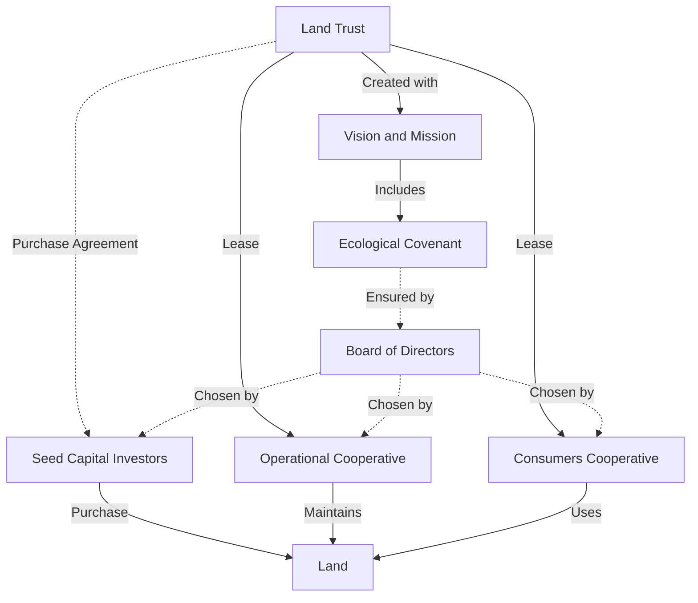

# CowStructure Before Purchase is Complete

    
# CowStructure After Purchase is Complete
```mermaid
graph TD;
    LandTrust[Land Trust] -->|Owns| Land[Land];
    LandTrust -->|Lease| OperationalCoop[Operational Cooperative];
    LandTrust -->|Lease| ConsumersCoop[Consumers Cooperative];
    OperationalCoop -->|Maintains| Land;
    ConsumersCoop -->|Uses| Land;
    LandTrust -->|Created with| VisionMission[Vision and Mission];
    VisionMission -->|Includes| EcologicalCovenant[Ecological Covenant];
    EcologicalCovenant -.->|Ensured by| Board;
    Board -->|Elected by| OperationalCoop;
    Board -->|Elected by| ConsumersCoop;
````
