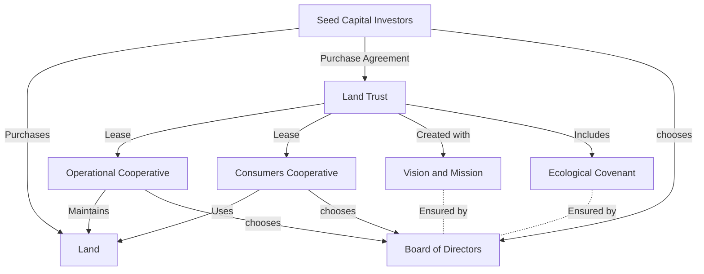

# CowStructure of Capital & Ownership
Initially, the Seed Capital Investors (SCI) purchase the Land.
The Land Trust enters into a land contract or purchase agreement with the SCI.
The Land Trust then grants a 99 year lease to two cooperatives:
 An Operational Cooperative  (Facilities or F)
 A Consumers Cooperative (Insiders of I)
The Land Trust will be created with Vision and Mission statement along with an Ecological Covenant.
The Board of Directors of the Land Trust will serve to ensure that the use of the land is in alignment with the Vision and Mission and that all parties follow the Ecological Covenant.

The structure of the Board of Directors of the Land Trust will have two different states.
The state before the sale is complete between the SCI and the land trust
The state after the sale is complete between the SCI and the Land Trust

In the initial state:
The Board of Directors has 5 voting members and as many non-voting advisory members as the voting member decide to elect.
The Board of Directors Voting members will be as follows:
3 members chosen by the Seed Capital Investors (SCI)
1 member chosen by The Operational Cooperative (F)
1 member chosen by The Consumers Cooperative (I)

In the state, after the Land Trust has completed the purchase of the land:
The Board of Directors has 7 voting members.
The Board of Directors are elected by the members of the The Operational Cooperative and the Consumers Cooperative


# CowStructure Before Purchase is Complete

    
# CowStructure After Purchase is Complete
```mermaid
graph TD;
    LandTrust[Land Trust] -->|Owns| Land[Land];
    LandTrust -->|Lease| OperationalCoop[Operational Cooperative];
    LandTrust -->|Lease| ConsumersCoop[Consumers Cooperative];
    OperationalCoop -->|Maintains| Land;
    ConsumersCoop -->|Uses| Land;
    LandTrust -->|Created with| VisionMission[Vision and Mission];
    VisionMission -->|Includes| EcologicalCovenant[Ecological Covenant];
    EcologicalCovenant -.->|Ensured by| Board;
    Board -->|Elected by| OperationalCoop;
    Board -->|Elected by| ConsumersCoop;
````
